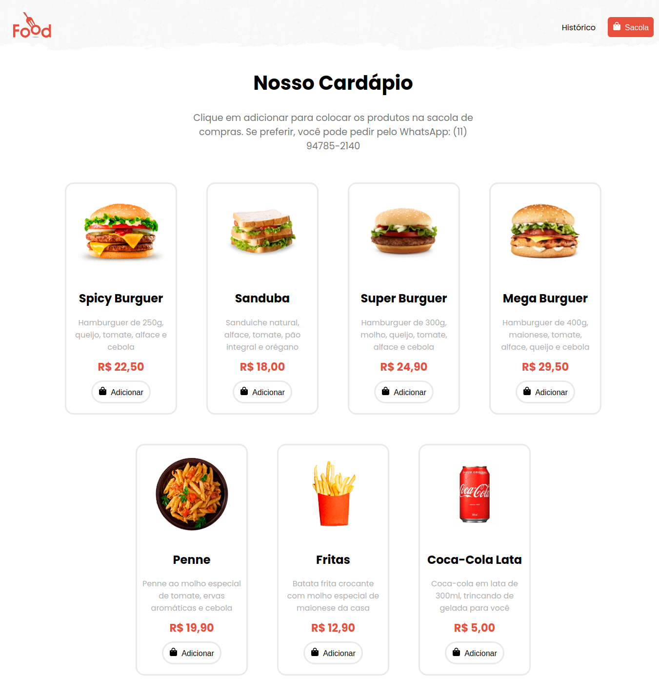
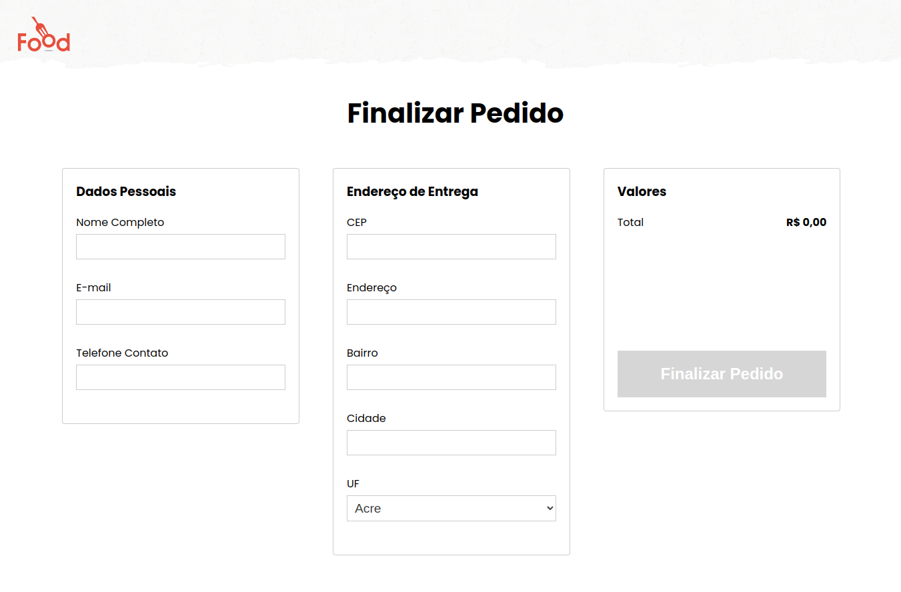

<h1 align="center">🥘 Food 🍽️</h1>

<p align="center">Projeto cardápio digital (Food) desenvolvido na Jornada JS da DevPoint.</p>

<p align="center">
  
</p>

<br>

## Tópicos
- [Algumas telas do projeto](#imgs)
- [Sobre o projeto](#sobre)
- [Funcionalidades do projeto](#func)
- [Tecnologias utilizadas](#tec)
- [Executando o projeto](#exec)
- [Status do projeto](#status)
- [Licença](#license)

<br>

<h2 id="imgs">🖼️ Algumas telas do projeto</h2>

<div>
  

  
</div>

<br>

<h2 id="sobre">🍲 Sobre o projeto</h2>

<p align="justify">
  Food é um cardápio digital de entrega focado em hambúrgueres e outros produtos de fast food.
</p>

<br>

<h2 id="func">🛠️ Funcionalidades do projeto</h2>

- Exibe um cardápio com uma variedade de opções de produtos;

- Opção de adicionar e remover os produtos da sacola;

- Exibe o histórico de pedidos.

<br>

<h2 id="tec">❤️‍🔥 Tecnologias utilizadas</h2>

- SQLite
- NodeJs
- ReactJs
- Git e Github

<br>

<h2 id="exec">🤖 Executando o projeto</h2>

<h3>Pré-requisito</h3>

- [NodeJS LTS](https://nodejs.org/en/)

<h3>Executando a API</h3>

```
# Clone este repositório
$ git clone https://github.com/Fel1324/Food.git

# Acesse a pasta do projeto no terminal/cmd
$ cd Food

# Acesse a pasta da API
$ cd api

# Instale as dependências da API
$ npm install ou npm i

# Execute a API
$ node ./src/index.js
```

> A API irá iniciar na porta 3001

<br>

<h3>Executando o projeto na web</h3>

```
# Abra outro terminal/cmd

# Se estiver na pasta api volte um diretório
$ cd ..

# Acesse a pasta web
$ cd web

# Instale as dependências
$ npm install ou npm i

# Execute o projeto
$ npm start
```

> O servidor irá iniciar em -> http://localhost:3000

<br>

<h2 id="status">🚧 Status do projeto</h2>

Projeto finalizado ✅

<br>

<h2 id="license">📝 Licença</h2

Esse projeto está sob a licença MIT.
